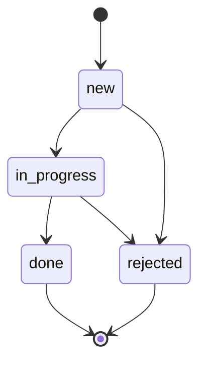

# maintenance-api

REST API на Express для учёта оборудования производственной площадки (например,
ветропарка) и заявок на его техническое обслуживание. Сервис ведёт справочник
оборудования, контролирует жизненный цикл заявок и по координатам объекта оценивает
погодные условия перед планированием наружных работ (модуль Open-Meteo из проекта
[weather-digest](https://github.com/oxolegit/weather-digest)).

Данные хранятся в JSON-файлах (или в памяти процесса) и доступны только через слой
репозиториев — при переезде на PostgreSQL меняется только этот слой.

## Содержание

- [Требования к окружению](#требования-к-окружению)
- [Установка и запуск](#установка-и-запуск)
- [Переменные окружения](#переменные-окружения)
- [Эндпоинты](#эндпоинты)
- [Модель данных](#модель-данных)
- [Формат ответов и коды](#формат-ответов-и-коды)
- [Примеры запросов](#примеры-запросов)
- [Списки: фильтры, сортировка, пагинация](#списки-фильтры-сортировка-пагинация)
- [Прогноз погоды и правило пригодности](#прогноз-погоды-и-правило-пригодности)
- [Безопасность](#безопасность)
- [Middleware и обработка ошибок](#middleware-и-обработка-ошибок)
- [Логирование](#логирование)
- [Структура проекта](#структура-проекта)
- [Postman](#postman)
- [Разработка](#разработка)

## Требования к окружению

- Node.js 20.12 и выше (используются встроенные `fetch`, `process.loadEnvFile`, `structuredClone`).
- Доступ в интернет к `api.open-meteo.com` для эндпоинта прогноза (остальной API работает без сети).

## Установка и запуск

```bash
git clone https://github.com/oxolegit/maintenance-api.git
cd maintenance-api
npm install
cp .env.example .env
npm start
```

Сервер поднимается на `http://localhost:3000` (порт настраивается). Проверка:

```bash
curl http://localhost:3000/api/health
```

Режим разработки с автоперезапуском и читаемыми логами:

```bash
npm run dev
```

По умолчанию данные сохраняются в каталог `data/` (в репозиторий не попадает).
Для запуска «с чистого листа» без записи на диск задайте `STORAGE_DRIVER=memory`.

## Переменные окружения

Файл `.env.example` содержит все переменные со значениями по умолчанию. Файл `.env`
в репозиторий не попадает. Приложение проверяет переменные при старте и завершается с
понятным сообщением, если значение некорректно (например, `PORT=abc`).

| Переменная                     | Назначение                                                              | По умолчанию                                  |
| ------------------------------ | ----------------------------------------------------------------------- | --------------------------------------------- |
| `PORT`                         | Порт HTTP-сервера                                                       | `3000`                                        |
| `NODE_ENV`                     | `development` / `test` / `production`                                   | `development`                                 |
| `LOG_LEVEL`                    | Уровень логирования pino                                                | `info`                                        |
| `CORS_ORIGINS`                 | Разрешённые источники CORS через запятую                                | `http://localhost:3000,http://localhost:5173` |
| `RATE_LIMIT_WINDOW_MS`         | Окно ограничения частоты, мс                                            | `60000`                                       |
| `RATE_LIMIT_MAX`               | Максимум запросов к `/api` с одного IP за окно                          | `100`                                         |
| `JSON_BODY_LIMIT`              | Максимальный размер JSON-тела                                           | `100kb`                                       |
| `STORAGE_DRIVER`               | `file` — JSON-файлы, `memory` — только память процесса                  | `file`                                        |
| `DATA_DIR`                     | Каталог для JSON-файлов хранилища                                       | `data`                                        |
| `WEATHER_API_URL`              | URL API прогноза Open-Meteo                                             | `https://api.open-meteo.com/v1/forecast`      |
| `REQUEST_TIMEOUT_MS`           | Таймаут запроса к внешнему API, мс                                      | `5000`                                        |
| `WEATHER_FORECAST_DAYS`        | Число дней прогноза по умолчанию (1–7)                                  | `3`                                           |
| `WEATHER_MAX_WIND_SPEED_MS`    | Порог ветра для наружных работ, м/с                                     | `10`                                          |
| `WEATHER_MAX_PRECIPITATION_MM` | Порог осадков для наружных работ, мм                                    | `0`                                           |
| `WEATHER_CACHE_TTL_MS`         | Время жизни кэша прогноза, мс (`0` — без кэша)                          | `600000`                                      |
| `API_KEY`                      | Ключ для изменяющих операций (заголовок `X-API-Key`); пусто — выключено | `change-me` в `.env.example`, пусто в коде    |

## Эндпоинты

Все маршруты имеют префикс `/api`. Операции, помеченные 🔒, требуют заголовок
`X-API-Key`, если задана переменная `API_KEY`.

| Метод       | Путь                          | Назначение                                                 | Успех              |
| ----------- | ----------------------------- | ---------------------------------------------------------- | ------------------ |
| `GET`       | `/api/health`                 | Проверка доступности сервиса                               | `200`              |
| `GET`       | `/api/equipment`              | Список оборудования: фильтры, сортировка, пагинация        | `200`              |
| `POST` 🔒   | `/api/equipment`              | Создание единицы оборудования                              | `201` + `Location` |
| `GET`       | `/api/equipment/:id`          | Карточка оборудования                                      | `200`              |
| `PATCH` 🔒  | `/api/equipment/:id`          | Частичное обновление                                       | `200`              |
| `DELETE` 🔒 | `/api/equipment/:id`          | Удаление (запрещено при открытых заявках)                  | `204`              |
| `GET`       | `/api/equipment/:id/requests` | Заявки по конкретной единице оборудования                  | `200`              |
| `GET`       | `/api/equipment/:id/weather`  | Прогноз по координатам и пригодность окна для работ        | `200`              |
| `GET`       | `/api/requests`               | Список заявок: фильтры, сортировка, пагинация              | `200`              |
| `POST` 🔒   | `/api/requests`               | Создание заявки                                            | `201` + `Location` |
| `POST` 🔒   | `/api/requests/batch`         | Массовый импорт заявок с отчётом по каждой записи          | `207`              |
| `GET`       | `/api/requests/:id`           | Карточка заявки                                            | `200`              |
| `PATCH` 🔒  | `/api/requests/:id`           | Редактирование полей заявки (кроме статуса и оборудования) | `200`              |
| `PATCH` 🔒  | `/api/requests/:id/status`    | Смена статуса с проверкой допустимости перехода            | `200`              |
| `DELETE` 🔒 | `/api/requests/:id`           | Удаление заявки                                            | `204`              |

## Модель данных

### Оборудование (`equipment`)

| Поле                     | Тип                                                           | Правила                                       |
| ------------------------ | ------------------------------------------------------------- | --------------------------------------------- |
| `id`                     | string (uuid)                                                 | генерируется сервером                         |
| `name`                   | string                                                        | обязательное, 3–100 символов                  |
| `type`                   | `turbine` \| `inverter` \| `sensor` \| `substation`           | обязательное                                  |
| `serialNumber`           | string                                                        | обязательное, уникальное, до 64 символов      |
| `location`               | `{ lat: number, lon: number }`                                | обязательное, широта −90…90, долгота −180…180 |
| `status`                 | `operational` \| `maintenance` \| `fault` \| `decommissioned` | по умолчанию `operational`                    |
| `installedAt`            | ISO-дата (`2024-05-10` или дата-время)                        | обязательное, не в будущем                    |
| `createdAt`, `updatedAt` | ISO-дата-время                                                | проставляются сервером                        |

### Заявка на обслуживание (`request`)

| Поле                     | Тип                                            | Правила                                           |
| ------------------------ | ---------------------------------------------- | ------------------------------------------------- |
| `id`                     | string (uuid)                                  | генерируется сервером                             |
| `equipmentId`            | string (uuid)                                  | обязательное, ссылка на существующее оборудование |
| `title`                  | string                                         | обязательное, 5–120 символов                      |
| `description`            | string                                         | до 2000 символов, по умолчанию `""`               |
| `priority`               | `low` \| `medium` \| `high` \| `critical`      | по умолчанию `medium`                             |
| `status`                 | `new` \| `in_progress` \| `done` \| `rejected` | при создании всегда `new`                         |
| `plannedAt`              | ISO-дата-время или `null`                      | необязательное                                    |
| `createdAt`, `updatedAt` | ISO-дата-время                                 | проставляются сервером                            |

Поля `id`, `createdAt`, `updatedAt` нельзя передать или изменить через API — они,
как и любые неизвестные поля тела запроса, отбрасываются валидатором. Статус заявки
меняется только через `PATCH /api/requests/:id/status`; в `POST` и `PATCH /api/requests/:id`
поле `status` игнорируется.

### Переходы статусов заявки



| Из \ В        | `new` | `in_progress` | `done` | `rejected` |
| ------------- | :---: | :-----------: | :----: | :--------: |
| `new`         |   –   |       ✔       |   –    |     ✔      |
| `in_progress` |   –   |       –       |   ✔    |     ✔      |
| `done`        |   –   |       –       |   –    |     –      |
| `rejected`    |   –   |       –       |   –    |     –      |

Таблица переходов лежит в `src/services/requestService.js`; недопустимый переход
(в том числе повтор текущего статуса) отклоняется с `409 INVALID_STATUS_TRANSITION`,
в `details` перечислены допустимые переходы из текущего статуса.

Заявки со статусами `new` и `in_progress` считаются открытыми: пока они есть,
оборудование удалить нельзя (`409 EQUIPMENT_HAS_OPEN_REQUESTS`). Закрытые заявки
(`done`, `rejected`) при удалении оборудования сохраняются как история. Создать заявку
на списанное оборудование (`decommissioned`) нельзя — `409 EQUIPMENT_DECOMMISSIONED`.

## Формат ответов и коды

Одиночный объект всегда лежит в `data`, список — в `data` с метаданными в `meta`:

```json
{ "data": { "id": "…", "name": "…" } }
```

```json
{
  "data": [{ "id": "…" }],
  "meta": { "total": 42, "page": 2, "limit": 20, "pages": 3 }
}
```

Все ошибки имеют единый формат. `requestId` совпадает с заголовком `X-Request-Id`
ответа и с записью в логах сервера. `details` присутствует у ошибок валидации и
конфликтов, где есть что уточнить по полям:

```json
{
  "error": {
    "code": "VALIDATION_ERROR",
    "message": "Некорректные данные запроса",
    "details": [
      {
        "field": "priority",
        "message": "Допустимые значения: low, medium, high, critical",
        "location": "body"
      }
    ],
    "requestId": "b1f2c3d4"
  }
}
```

| Код           | Когда                                                                                 | `error.code`                                                                                                  |
| ------------- | ------------------------------------------------------------------------------------- | ------------------------------------------------------------------------------------------------------------- |
| `200`         | Успешное чтение или обновление                                                        | —                                                                                                             |
| `201`         | Сущность создана, в заголовке `Location` — её адрес                                   | —                                                                                                             |
| `204`         | Сущность удалена, тело пустое                                                         | —                                                                                                             |
| `207`         | Массовый импорт: результат по каждой записи внутри тела                               | —                                                                                                             |
| `400`         | Запрос синтаксически некорректен: битый JSON, неверные параметры пути или query       | `INVALID_JSON`, `VALIDATION_ERROR`                                                                            |
| `401`         | Нет или неверный `X-API-Key` на изменяющей операции                                   | `UNAUTHORIZED`                                                                                                |
| `404`         | Сущность или маршрут не найдены, в т.ч. заявка на несуществующее оборудование         | `NOT_FOUND`, `EQUIPMENT_NOT_FOUND`, `ROUTE_NOT_FOUND`                                                         |
| `409`         | Конфликт с текущим состоянием данных                                                  | `SERIAL_NUMBER_TAKEN`, `INVALID_STATUS_TRANSITION`, `EQUIPMENT_HAS_OPEN_REQUESTS`, `EQUIPMENT_DECOMMISSIONED` |
| `413`         | Тело запроса больше `JSON_BODY_LIMIT`                                                 | `PAYLOAD_TOO_LARGE`                                                                                           |
| `422`         | Тело запроса разобрано, но не проходит правила предметной области (длины, enum, даты) | `VALIDATION_ERROR`                                                                                            |
| `429`         | Превышен лимит частоты запросов                                                       | `RATE_LIMITED`                                                                                                |
| `502` / `504` | Внешний погодный сервис ответил ошибкой / не ответил за `REQUEST_TIMEOUT_MS`          | `UPSTREAM_ERROR`, `UPSTREAM_TIMEOUT`                                                                          |
| `500`         | Непредвиденная ошибка; в production без внутренних деталей                            | `INTERNAL_ERROR`                                                                                              |

Разделение `400`/`422`: `400` — запрос нельзя обработать в принципе (нечитаемое тело,
`page=0`, идентификатор не в формате UUID), `422` — запрос понятен, но данные
нарушают бизнес-правила модели (короткое название, неизвестный приоритет, дата установки
в будущем). Каждая ошибка валидации перечисляет все проблемные поля с причиной и
местом (`body`, `params`, `query`).

## Примеры запросов

Создание оборудования:

```bash
curl -i -X POST http://localhost:3000/api/equipment \
  -H "Content-Type: application/json" -H "X-API-Key: change-me" \
  -d '{
    "name": "Ветротурбина ВТ-01",
    "type": "turbine",
    "serialNumber": "WT-2024-001",
    "location": { "lat": 55.7522, "lon": 37.6156 },
    "installedAt": "2024-05-10"
  }'
```

```http
HTTP/1.1 201 Created
Location: /api/equipment/0f1b6f0e-2f5e-4a60-9f7e-1c0b8d5b1a11
X-Request-Id: 3f9a1c2b
Content-Type: application/json; charset=utf-8

{
  "data": {
    "id": "0f1b6f0e-2f5e-4a60-9f7e-1c0b8d5b1a11",
    "name": "Ветротурбина ВТ-01",
    "type": "turbine",
    "serialNumber": "WT-2024-001",
    "location": { "lat": 55.7522, "lon": 37.6156 },
    "status": "operational",
    "installedAt": "2024-05-10",
    "createdAt": "2026-09-20T17:25:34.941Z",
    "updatedAt": "2026-09-20T17:25:34.941Z"
  }
}
```

Повторный запрос с тем же серийным номером:

```json
{
  "error": {
    "code": "SERIAL_NUMBER_TAKEN",
    "message": "Серийный номер WT-2024-001 уже занят",
    "details": [{ "field": "serialNumber", "message": "Серийный номер уже занят" }],
    "requestId": "51bea6e7"
  }
}
```

Создание заявки:

```bash
curl -X POST http://localhost:3000/api/requests \
  -H "Content-Type: application/json" -H "X-API-Key: change-me" \
  -d '{
    "equipmentId": "0f1b6f0e-2f5e-4a60-9f7e-1c0b8d5b1a11",
    "title": "Замена подшипника главного вала",
    "priority": "high",
    "plannedAt": "2026-10-05T09:00:00Z"
  }'
```

```json
{
  "data": {
    "id": "e0a19e2e-825a-4414-925e-0a035d53b2dd",
    "equipmentId": "0f1b6f0e-2f5e-4a60-9f7e-1c0b8d5b1a11",
    "title": "Замена подшипника главного вала",
    "description": "",
    "priority": "high",
    "plannedAt": "2026-10-05T09:00:00Z",
    "status": "new",
    "createdAt": "2026-09-20T17:28:43.922Z",
    "updatedAt": "2026-09-20T17:28:43.922Z"
  }
}
```

Заявка на несуществующее оборудование — `404`:

```json
{
  "error": {
    "code": "EQUIPMENT_NOT_FOUND",
    "message": "Оборудование 11111111-1111-4111-8111-111111111111 не найдено",
    "requestId": "2572a687"
  }
}
```

Некорректное тело заявки — `422` с перечнем полей:

```json
{
  "error": {
    "code": "VALIDATION_ERROR",
    "message": "Некорректные данные запроса",
    "details": [
      { "field": "title", "message": "Длина должна быть от 5 до 120 символов", "location": "body" },
      {
        "field": "priority",
        "message": "Допустимые значения: low, medium, high, critical",
        "location": "body"
      },
      {
        "field": "plannedAt",
        "message": "Ожидается дата и время в формате ISO 8601",
        "location": "body"
      }
    ],
    "requestId": "7f3d7574"
  }
}
```

Смена статуса:

```bash
curl -X PATCH http://localhost:3000/api/requests/e0a19e2e-825a-4414-925e-0a035d53b2dd/status \
  -H "Content-Type: application/json" -H "X-API-Key: change-me" \
  -d '{ "status": "done" }'
```

Из `new` сразу в `done` нельзя — `409`:

```json
{
  "error": {
    "code": "INVALID_STATUS_TRANSITION",
    "message": "Переход из статуса new в done недопустим",
    "details": [
      { "field": "status", "message": "Из статуса new допустимы переходы: in_progress, rejected" }
    ],
    "requestId": "9c52bcf9"
  }
}
```

Удаление оборудования с открытой заявкой — `409`:

```json
{
  "error": {
    "code": "EQUIPMENT_HAS_OPEN_REQUESTS",
    "message": "Нельзя удалить оборудование: по нему есть незакрытые заявки (1)",
    "requestId": "d13c0f3d"
  }
}
```

Массовый импорт (`207`, каждая запись обрабатывается независимо):

```bash
curl -X POST http://localhost:3000/api/requests/batch \
  -H "Content-Type: application/json" -H "X-API-Key: change-me" \
  -d '{ "items": [
    { "equipmentId": "0f1b6f0e-2f5e-4a60-9f7e-1c0b8d5b1a11", "title": "Плановый осмотр гондолы" },
    { "equipmentId": "11111111-1111-4111-8111-111111111111", "title": "Заявка в никуда" },
    { "equipmentId": "0f1b6f0e-2f5e-4a60-9f7e-1c0b8d5b1a11", "title": "Кор" }
  ] }'
```

```json
{
  "data": {
    "summary": { "total": 3, "created": 1, "failed": 2 },
    "results": [
      { "index": 0, "status": 201, "data": { "id": "…", "status": "new", "…": "…" } },
      {
        "index": 1,
        "status": 404,
        "error": { "code": "EQUIPMENT_NOT_FOUND", "message": "Оборудование … не найдено" }
      },
      {
        "index": 2,
        "status": 422,
        "error": {
          "code": "VALIDATION_ERROR",
          "message": "Некорректные данные запроса",
          "details": [{ "field": "title", "message": "Длина должна быть от 5 до 120 символов" }]
        }
      }
    ]
  }
}
```

Изменяющая операция без ключа — `401`:

```json
{
  "error": {
    "code": "UNAUTHORIZED",
    "message": "Для изменяющих операций требуется заголовок X-API-Key",
    "requestId": "9834e6b9"
  }
}
```

## Списки: фильтры, сортировка, пагинация

Общие параметры для `GET /api/equipment`, `GET /api/requests` и
`GET /api/equipment/:id/requests`:

| Параметр | Значение                     | По умолчанию |
| -------- | ---------------------------- | ------------ |
| `page`   | номер страницы, целое ≥ 1    | `1`          |
| `limit`  | размер страницы, целое 1–100 | `20`         |
| `sort`   | поле сортировки (см. ниже)   | `createdAt`  |
| `order`  | `asc` \| `desc`              | `desc`       |

Оборудование: фильтры `type`, `status`, `installedFrom`, `installedTo` (даты `ГГГГ-ММ-ДД`,
границы включительно), `q` — подстрока в названии или серийном номере без учёта регистра;
сортировка по `createdAt`, `updatedAt`, `name`, `type`, `status`, `installedAt`.

Заявки: фильтры `status`, `priority`, `equipmentId`, `createdFrom`/`createdTo`,
`plannedFrom`/`plannedTo`; сортировка по `createdAt`, `updatedAt`, `plannedAt`, `title`, `status`.
Во вложенном ресурсе `equipmentId` берётся из пути.

Все параметры проверяются: неизвестное поле сортировки или `limit=500` дают `400` с
описанием проблемы.

```bash
curl "http://localhost:3000/api/requests?status=new&priority=high&createdFrom=2026-09-01&sort=plannedAt&order=asc&page=1&limit=10"
```

## Прогноз погоды и правило пригодности

`GET /api/equipment/:id/weather?days=3` берёт координаты оборудования и запрашивает у
Open-Meteo дневной прогноз (`days` — 1–7, по умолчанию `WEATHER_FORECAST_DAYS`).
Клиент внешнего API (`src/clients/http.js`, `src/clients/openMeteo.js`) перенесён из
проекта weather-digest и подключён как отдельный сервис `src/services/weatherService.js`.

Правило пригодности окна задаётся в конфигурации: день подходит для наружных работ,
если `precipitation <= WEATHER_MAX_PRECIPITATION_MM` **и**
`windSpeedMax <= WEATHER_MAX_WIND_SPEED_MS`. По умолчанию — без осадков и ветер до 10 м/с.

```json
{
  "data": {
    "equipmentId": "0f1b6f0e-2f5e-4a60-9f7e-1c0b8d5b1a11",
    "equipmentName": "Ветротурбина ВТ-01",
    "location": { "lat": 55.7522, "lon": 37.6156 },
    "generatedAt": "2026-09-20T17:30:24.048Z",
    "rule": { "maxWindSpeedMs": 10, "maxPrecipitationMm": 0 },
    "days": [
      {
        "date": "2026-09-20",
        "tempMin": 9.9,
        "tempMax": 18.9,
        "precipitation": 0,
        "windSpeedMax": 3.2,
        "windGustsMax": 8.9,
        "suitable": true,
        "reasons": []
      },
      {
        "date": "2026-09-21",
        "tempMin": 13.3,
        "tempMax": 18.9,
        "precipitation": 6.5,
        "windSpeedMax": 3.1,
        "windGustsMax": 8.8,
        "suitable": false,
        "reasons": ["осадки 6.5 мм выше порога 0 мм"]
      }
    ],
    "hasSuitableWindow": true,
    "nextSuitableDate": "2026-09-20"
  }
}
```

Ответ кэшируется в памяти на `WEATHER_CACHE_TTL_MS` по координатам и числу дней, чтобы не
дёргать внешний API на каждый запрос. Недоступность Open-Meteo не роняет сервис: ошибка
или неверный ответ дают `502 UPSTREAM_ERROR`, превышение таймаута — `504 UPSTREAM_TIMEOUT`,
оба — в едином формате с понятным сообщением; подробности пишутся в лог.

## Безопасность

**CORS.** Список разрешённых источников задаётся переменной `CORS_ORIGINS` и никогда не
равен `*`. По умолчанию разрешены `http://localhost:3000` (сама страница из `public/`, ей
CORS фактически не нужен — тот же origin) и `http://localhost:5173` (dev-сервер Vite для
отдельного фронтенда). Для чужого origin заголовки `Access-Control-*` не выдаются, и браузер
блокирует ответ. Разрешены методы `GET, POST, PATCH, DELETE`, заголовки
`Content-Type, X-API-Key, X-Request-Id`; клиенту открыты `Location, X-Request-Id, RateLimit*,
Retry-After`. Preflight кэшируется на 10 минут.

**Ограничение частоты.** На все маршруты `/api` действует лимит `RATE_LIMIT_MAX` запросов с
одного IP за `RATE_LIMIT_WINDOW_MS`. Ответы содержат заголовки `RateLimit` и
`RateLimit-Policy` (draft-7); при превышении — `429 RATE_LIMITED` и `Retry-After`.

**Размер тела и заголовки.** JSON-тело ограничено `JSON_BODY_LIMIT` (превышение — `413`).
`helmet` выставляет защитные заголовки (`Content-Security-Policy`, `X-Content-Type-Options`,
`X-Frame-Options`, `Strict-Transport-Security` и др.), `X-Powered-By` отключён.

**API-ключ.** Если задан `API_KEY`, все `POST`, `PATCH`, `DELETE` требуют заголовок
`X-API-Key`; сравнение ключей выполняется за постоянное время (`crypto.timingSafeEqual`).
Чтение остаётся открытым. Пустой `API_KEY` отключает проверку — при старте пишется
предупреждение, для production так делать не стоит.

**Cookie.** Сервис не использует cookie и сессии: аутентификация — по заголовку, состояние
на сервере не хранится, поэтому CSRF-риск отсутствует. Если бы токен выдавался в cookie, он
был бы `HttpOnly` (недоступен скриптам), `Secure` (только по HTTPS) и `SameSite=Strict`:
API не должен получать cookie при переходах с других сайтов, а фронтенд из списка
`CORS_ORIGINS` работает на том же сайте либо использует заголовок. `Lax` понадобился бы
только для навигационных `GET` со сторонних ресурсов, которых у API нет.

**Секреты.** В репозитории нет `.env` и реальных ключей — только `.env.example` с
плейсхолдерами. В production (`NODE_ENV=production`) ответы `500` не содержат сообщений
внутренних ошибок и стек-трейсов; они остаются только в логах.

## Middleware и обработка ошибок

Порядок подключения в `src/app.js`:

1. `requestId` — присваивает идентификатор (или принимает `X-Request-Id` клиента) и
   возвращает его в заголовке. Стоит первым, чтобы идентификатор был у всех последующих
   слоёв, включая логгер и ошибки разбора JSON.
2. `requestLogger` — на завершении ответа пишет метод, путь, код, длительность и
   `requestId`. Подключён до защитных middleware, чтобы отклонённые запросы (429, CORS)
   тоже попадали в лог.
3. `helmet`, `cors`, `rateLimit` — защита срабатывает до разбора тела: лишнюю работу для
   заблокированных запросов не делаем, preflight обрабатывается до лимитера.
4. `apiKeyAuth` — проверка ключа на изменяющих операциях `/api`; стоит до разбора тела,
   чтобы не тратить ресурсы на запросы без ключа.
5. `express.json({ limit })` — разбор JSON с ограничением размера.
6. Маршруты `/api` и статика `public/`: на каждом маршруте `validate({ body, params, query })` с Zod-схемами из
   `src/validators/`. Валидатор отбрасывает неизвестные поля и складывает результат в
   `req.validated`, контроллеры работают только с проверенными данными.
7. `notFound` — любой незнакомый маршрут превращается в `404 ROUTE_NOT_FOUND`.
8. `errorHandler` — единственное место, где ошибки превращаются в HTTP-ответы.

Ошибки приложения описаны собственными типами в `src/errors/index.js` (`AppError` и
наследники `ValidationError`, `NotFoundError`, `ConflictError`, `UnauthorizedError`,
`TooManyRequestsError`, `UpstreamError` и др.) и не зависят от Express: сервисы и
репозитории бросают их, не зная о HTTP. Обработчик ошибок сопоставляет тип с кодом ответа,
ошибки body-parser (`entity.parse.failed`, `entity.too.large`) переводит в `400`/`413`,
всё остальное — в `500` с записью в лог.

Асинхронные ошибки контроллеров не теряются: используется Express 5, который передаёт
отклонённый промис обработчика в `next(err)` автоматически, поэтому обёртки над каждым
обработчиком не нужны. На уровне процесса `src/server.js` перехватывает
`unhandledRejection` и `uncaughtException`, пишет `fatal` в лог и корректно останавливает
сервер.

## Логирование

Используется `pino` с уровнями `fatal … trace` (`LOG_LEVEL`). Каждый запрос логируется
одной записью: `method`, `path`, `status`, `durationMs`, `requestId` — уровень `info` для
успешных ответов, `warn` для 4xx, `error` для 5xx. Ошибки логируются с тем же `requestId`,
который получает клиент, поэтому запись легко найти по ответу. `console.log` в коде нет —
это запрещено правилом ESLint. В `npm run dev` вывод форматируется `pino-pretty`.

```json
{
  "level": 30,
  "time": 1789925097682,
  "requestId": "a0212192",
  "method": "POST",
  "path": "/api/requests",
  "status": 201,
  "durationMs": 3.4,
  "msg": "запрос обработан"
}
```

## Структура проекта

```
src/
  app.js                  сборка приложения: middleware, маршруты, обработчик ошибок
  server.js               запуск HTTP-сервера, загрузка .env, остановка по сигналам
  logger.js               создание логгера pino
  config/index.js         разбор и проверка переменных окружения
  errors/index.js         типы ошибок приложения (не зависят от Express)
  middlewares/            requestId, requestLogger, cors, rateLimiter, apiKeyAuth,
                          validate, notFound, errorHandler
  validators/             Zod-схемы body/params/query для оборудования и заявок
  routes/                 маршруты: health, equipment (+ вложенные requests, weather), requests
  controllers/            тонкие обработчики: req → сервис → ответ
  services/               бизнес-логика: оборудование, заявки и переходы статусов, погода
  repositories/           доступ к данным: CollectionRepository поверх storage
    storage/              memoryStorage (память) и fileStorage (JSON-файлы, атомарная запись)
  clients/                HTTP-клиент и клиент Open-Meteo (из weather-digest)
  models/                 допустимые значения перечислений и полей сортировки
tests/                    Jest + Supertest
docs/postman/             коллекция и окружение Postman
```

Слои: маршруты → контроллеры → сервисы → репозитории. Контроллеры не содержат
бизнес-логики, сервисы не знают о HTTP, репозитории — единственное место работы с данными.
Замена хранилища на PostgreSQL сводится к новой реализации репозитория с тем же
интерфейсом (`list`, `findById`, `findOne`, `count`, `create`, `update`, `remove`): фильтры
передаются декларативно (`{ status: "new", createdAt: { gte, lte } }`) и легко переводятся в
`where` ORM. Приложение собирается функцией `createApp({ config, repositories, weatherClient, logger })`
отдельно от запуска сервера, что позволяет подключать его в тестах с хранилищем в памяти и
подменённым погодным клиентом.

## Postman

Коллекция `docs/postman/maintenance-api.postman_collection.json` и окружение
`docs/postman/local.postman_environment.json` (`baseUrl`, `apiKey`). Импортируйте оба файла,
выберите окружение «maintenance-api local» и запускайте коллекцию целиком (Collection Runner)
или запросы по порядку — идентификаторы созданных сущностей передаются между запросами через
переменные коллекции.

Папки: Health, Equipment, Requests, Негативные сценарии (400, 401, 404, 409, 422),
Лимит частоты (429 — pre-request скрипт исчерпывает лимит, поэтому папка идёт последней).
В каждом запросе есть `pm.test` на код ответа и структуру тела; на уровне коллекции
проверяются заголовок `X-Request-Id` и формат JSON.

Коллекция также прогоняется из консоли:

```bash
npx newman run docs/postman/maintenance-api.postman_collection.json \
  -e docs/postman/local.postman_environment.json
```

## Разработка

- Тесты (Jest + Supertest, 68 сценариев): `npm test`
- Линтер: `npm run lint`
- Форматирование: `npm run format`

Работа велась в отдельных ветках по функциональным блокам, каждая вливалась в `main`
через Pull Request.
